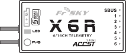
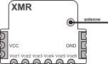

  

----------------------------------------------------------------------------------

### Nonofficial\_frsky\_doc/Latest_release/EN  

----------------------------------------------------------------------------------

#  FrSky documents in English
>##  Warning :  
>This is not a FrSky website.  
>FrSky is not responsible for the use of documents on this site.  
>FrSky is a registered trademark whose official site is https://www.frsky-rc.com/  
>FrSky agreed to the principle of setting up such a repository.  
>FrSky is informed of any new publication of documents on this repository  
>To make FrSky checks easier :  
>- the folder tree is voluntarily in English  
>- all `Readme.md` files have a section in English  
>- all release notes have a section in English  

## Definition of versions
-  : In English, this is FrSky's original document. You can download the document from https://www.frsky-rc.com/.  
-  : Improved translation of the FrSky document *enriched with unofficial information*  
-  : *Unpublished* documentation on a product or procedure  

## Table of content
- [Receiver - X8R](#X8R) (8 conventionnal channels + SPort / D8-D16 / Range >1,5km)  
- [Receiver - X6R](#X6R) (6 conventionnal channels + SPort / D8-D16 / Range >1,5km)  
- [Receiver - XMR](#XMR) (6 conventionnal channels / D16 / Range 600m / No telemetry)  
- [Accessory - RB16](#RB16) (Redundancy Bus 16 channels for 2 power supplies and for 2 receivers + overload protection)  
   

------------------------------------------------------------------------------------------------------------

>**You wish to support this initiative by making a donation,  
>you can do so by clicking on the following link :**   

------------------------------------------------------------------------------------------------------------

## Receiver - X8R  
  

**  [X8R - User manual - vPlus.En1.pdf](X8R%20-%20User%20manual%20-%20vPlus.En1.pdf)** (Update 2017/11/03)  

------------------------------------------------------------------------------------------------------------

## Receiver - X6R  
  

**  [X6R - User manual - vPlus.En1.pdf](X6R%20-%20User%20manual%20-%20vPlus.En1.pdf)** (Update 2017/11/03)  

------------------------------------------------------------------------------------------------------------

## Accessory - Redundancy bus 16 channels  
  

**  [Redundancy bus - User manual - vPlus.En2.pdf](Redundancy%20bus%20-%20User%20manual%20-%20vPlus.En2.pdf)**  (Update 2017/12/28)  

------------------------------------------------------------------------------------------------------------

## Receiver - XMR  
  

**  [XMR - Firmware Update - vUnpublished.En1.pdf](XMR%20-%20Firmware%20Update%20-%20vUnpublished.En1.pdf)**  (Update 2018/03/31)  
