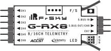
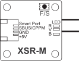
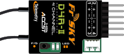
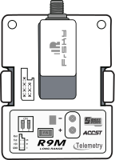
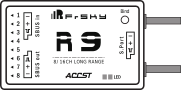

  

----------------------------------------------------------------------------------

### Nonofficial\_frsky\_doc/Latest_release/FR  

----------------------------------------------------------------------------------

#  Documents FrSky en Français
>##  Attention :  
>Ceci n'est pas un site officiel de FrSky.  
>FrSky n'est pas responsable de l'utilisation des documents présents sur ce site.  
>FrSky est une marque déposée dont le site officiel est https://www.frsky-rc.com/  
>FrSky a donné un accord de principe à la mise en place de ce dépôt.  
>FrSky est informé de toute nouvelle parution de documents sur ce dépôt.  
>Pour faciliter le contrôle par FrSky :  
>- l'arborescence des dossiers est volontairement en Anglais  
>- tous les fichiers `Readme.md` possèdent une section en Anglais  
>- toutes les notes de versions comportent une section en Anglais  

## Définition des versions
-  : traduction *la plus fidèle possible* du document FrSky 
-  : traduction améliorée du document FrSky *enrichie d'informations* non-officielles
-  : documentation *inédite* sur un produit ou une procédure

## Sommaire
- [Récepteur - D4RII](#D4RII) (2-4 voies conventionnelles + RSSI et CPPM en option + 1 Analog + 1 Num / D8 / Portée >1,5km)  
- [Récepteur - D8RII Plus](#D8RIIPlus) (8 voies conventionnelles + 2 Analog + 1 Num / D8 / Portée >1,5km)  
- [Récepteur - X8R](#X8R) (8 voies conventionnelles + SPort / D8-D16 / Portée >1,5km / SBUS OUT)  
- [Récepteur - X6R](#X6R) (6 voies conventionnelles + SPort + 1 Analog / D8-D16 / Portée >1,5km)  
- [Récepteur - X4R X4RSB](#X4R) (3/4 voies conventionnelles + SPort + 1 Analog / D16 / Portée >1,5km / SBUS pour X4RSB / CPPM selon config)  
- [Récepteur - S6R S8R](#S8R_S6R) (6 ou 8 voies conventionnelles + SPort/ D16 / Portée >1,5km / Gyro+Accel intégré / SBUS+RSSI pour le S8R)
- [Récepteur - G-RX8](#GRX8) (6-8 voies conventionnelles + SPort/ D16 / Portée >1,5km / Fct redondance SBUS IN / SBUS OUT / Altimètre intégré)
- [Récepteur - RX8R](#RX8R) (8 voies conventionnelles + SPort / D8-D16 / Portée >1,5km / Fct redondance SBUS IN / SBUS OUT)  
- [Récepteur - XSR](#XSR) (Sorties SBUS et CPPM + SPort / D16 / Portée >1,5km)  
- [Récepteur - XSR-M](#XSRM) (Uniquement SBUS ou CPPM + SPort / D16 / Portée >1,5km)  
- [Récepteur - R-XSR](#RXSR) (Uniquement SBUS ou CPPM + Sport / D16 / Portée >1,5km / Fct redondance SBUS IN)  
- [Récepteur - XM](#XM) (Uniquement SBUS / D16 / Portée 300m / Pas de télémétrie)  
- [Récepteur - XM+](#XM+) (Uniquement SBUS / D16 / Portée >1,5km / Pas de télémétrie)  
- [Récepteur - XMR](#XMR) (6 voies conventionnelles / D16 / Portée 600m / Pas de télémétrie)  
- [Récepteur - R9](#R9) (8 voies conventionnelles + SPort / R9M / Portée >10km / Fct redondance SBUS IN / SBUS OUT)  
- [Module d'émission - R9M](#R9M) (Longue portée 868MHz)
- [Capteur - VARI-H](#VARIH) (Variomètre précision Haute ou Normale)  
- [Capteur - FLVSS](#FLVSS) (Capteur tension pour batterie LiPo)  
- [Accessoire - SCC](#SCC) (Changeur d'Id pour servo SBUS ou capteur SPORT)  
- [Accessoire - RB16](#RB16) (Bus redondant 16 voies pour 2 alimentations et 2 récepteurs + protection contre les surcharges)  
 

------------------------------------------------------------------------------------------------------------

>**Vous souhaitez soutenir cette initiative  en faisant un don,  
>vous en avez la possibilité en cliquant sur le lien suivant :** 

------------------------------------------------------------------------------------------------------------

## Récepteur - X8R

**  [X8R - Manuel utilisateur - vFr6.pdf](X8R%20-%20Manuel%20utilisateur%20-%20vFr6.pdf)** (MaJ 28/12/2017)  
**  [X8R - Manuel utilisateur - vPlus.Fr4.pdf](X8R%20-%20Manuel%20utilisateur%20-%20vPlus.Fr4.pdf)** (MaJ 28/12/2017)  

------------------------------------------------------------------------------------------------------------

## Récepteur - X6R

**  [X6R - Manuel utilisateur - vFr4.pdf](X6R%20-%20Manuel%20utilisateur%20-%20vFr4.pdf)** (MaJ 28/12/2017)  
**  [X6R - Manuel utilisateur - vPlus.Fr4.pdf](X6R%20-%20Manuel%20utilisateur%20-%20vPlus.Fr4.pdf)** (MaJ 28/12/2017)  

------------------------------------------------------------------------------------------------------------

## Capteur - VARI-H (Variomètre)

**  [Variomètre - Manuel utilisateur - vFr4.pdf](Variomètre%20-%20Manuel%20utilisateur%20-%20vFr4.pdf)** (MaJ 28/12/2017)  

------------------------------------------------------------------------------------------------------------

## Accessoire - SCC

**  [SCC - Manuel utilisateur - vFr3.pdf](SCC%20-%20Manuel%20utilisateur%20-%20vFr3.pdf)** (MaJ 28/12/2017)  

------------------------------------------------------------------------------------------------------------

## Capteur - FLVSS

**  [FLVSS - Manuel utilisateur - vFr3.pdf](FLVSS%20-%20Manuel%20utilisateur%20-%20vFr3.pdf)** (MaJ 24/10/2017)  

------------------------------------------------------------------------------------------------------------

## Accessoire - Redundancy bus 16 voies

**  [Redundancy bus - Manuel utilisateur - vFr3.pdf](Redundancy%20bus%20-%20Manuel%20utilisateur%20-%20vFr3.pdf)** (MaJ 18/10/2017)  
**  [Redundancy bus - Manuel utilisateur - vPlus.Fr7.pdf](Redundancy%20bus%20-%20Manuel%20utilisateur%20-%20vPlus.Fr7.pdf)**  (MaJ 28/12/2017)  
**  [Redundancy bus - Procédure de mise à jour - vFr3.pdf](Redundancy%20bus%20-%20Procédure%20de%20mise%20à%20jour%20-%20vFr3.pdf)** (MaJ 14/11/2017)  

------------------------------------------------------------------------------------------------------------

## Récepteur - D8R-II plus

**  [D8R-II Plus - Manuel utilisateur - vFr3.pdf](D8R-II%20Plus%20-%20Manuel%20utilisateur%20-%20vFr3.pdf)** (MaJ 29/09/2017)  

------------------------------------------------------------------------------------------------------------

## Récepteur - XM

**  [XM - Manuel utilisateur - vFr2.pdf](XM%20-%20Manuel%20utilisateur%20-%20vFr2.pdf)** (MaJ 06/06/2018)  

------------------------------------------------------------------------------------------------------------

## Récepteur - XM+

**  [XM+ - Manuel utilisateur - vFr2.pdf](XM+%20-%20Manuel%20utilisateur%20-%20vFr2.pdf)** (MaJ 06/06/2018)  

------------------------------------------------------------------------------------------------------------

## Récepteur - XMR

**  [XMR - Manuel utilisateur - vFr2.pdf](XMR%20-%20Manuel%20utilisateur%20-%20vFr2.pdf)** (MaJ 06/06/2018)  
**  [XMR - MaJ Firmware - vInédit.Fr1.pdf](XMR%20-%20MaJ%20Firmware%20-%20vInédit.Fr1.pdf)** (MaJ 31/03/2018)  

------------------------------------------------------------------------------------------------------------

## Récepteur - S6R & S8R

**  [S6R S8R - Manuel utilisateur - vFr1.pdf](S6R%20S8R%20-%20Manuel%20utilisateur%20-%20vFr1.pdf)** (MaJ 26/11/2017)  

------------------------------------------------------------------------------------------------------------

## Récepteur - G-RX8

**  [G-RX8 - Manuel utilisateur - vFr1.pdf](G-RX8%20-%20Manuel%20utilisateur%20-%20vFr1.pdf)** (MaJ 26/11/2017)  

------------------------------------------------------------------------------------------------------------

## Récepteur - RX8R

**  [RX8R - Manuel utilisateur - vFr1.pdf](RX8R%20-%20Manuel%20utilisateur%20-%20vFr1.pdf)** (MaJ 28/12/2017)  

------------------------------------------------------------------------------------------------------------

## Récepteur - R-XSR

**  [R-XSR - Manuel utilisateur - vFr1.pdf](R-XSR%20-%20Manuel%20utilisateur%20-%20vFr1.pdf)** (MaJ 28/12/2017)  

------------------------------------------------------------------------------------------------------------

## Récepteur - X4R et X4RSB

**  [X4R X4RSB - Manuel utilisateur - vFr1.pdf](X4R%20X4RSB%20-%20Manuel%20utilisateur%20-%20vFr1.pdf)** (MaJ 01/02/2018)  

------------------------------------------------------------------------------------------------------------

## Récepteur - XSR

**  [XSR - Manuel utilisateur - vFr1.pdf](XSR%20-%20Manuel%20utilisateur%20-%20vFr1.pdf)** (MaJ 02/03/2018)  

------------------------------------------------------------------------------------------------------------

## Récepteur - XSR-M

**  [XSR-M - Manuel utilisateur - vFr1.pdf](XSR-M%20-%20Manuel%20utilisateur%20-%20vFr1.pdf)** (MaJ 31/03/2018)  

------------------------------------------------------------------------------------------------------------

## Récepteur - D4R-II

**  [D4R-II - Manuel utilisateur - vFr1.pdf](D4R-II%20-%20Manuel%20utilisateur%20-%20vFr1.pdf)** (MaJ 31/03/2018)  

------------------------------------------------------------------------------------------------------------

## Module d'émission - R9M

**  [R9M Tx EU - Manuel utilisateur - vFr1.pdf](R9M%20Tx%20EU%20-%20Manuel%20utilisateur%20-%20vFr1.pdf)** (MaJ 06/06/2018)  

------------------------------------------------------------------------------------------------------------

## Récepteur - R9

**  [R9 - Manuel utilisateur - vFr1.pdf](R9%20-%20Manuel%20utilisateur%20-%20vFr1.pdf)** (MaJ 06/06/2018)  
